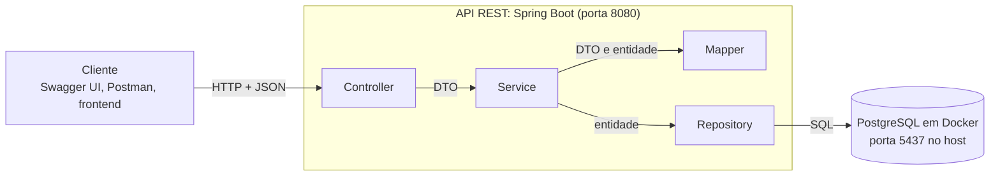
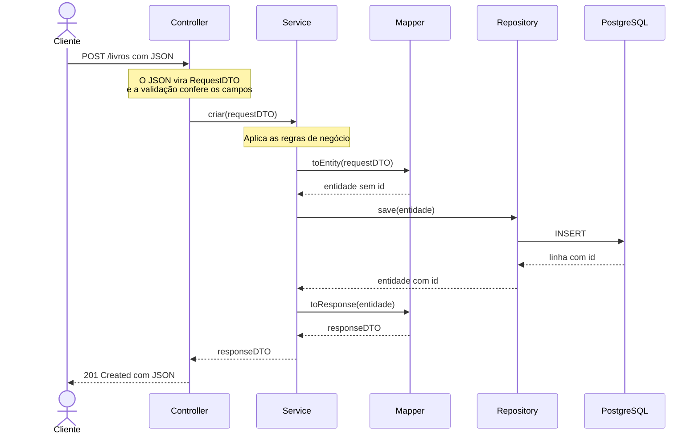

# Arquitetura de referência do Projeto Final

**Disciplina:** Backend (Engenharia de Software)
**Professor:** Daniel Plácido

O desenho que todo projeto segue, qualquer que seja o tema. É a mesma arquitetura do `exemplo_tarefas` da [Aula 09](<../Aula 09/exemplo_tarefas_resolvido>), sem o domínio de tarefas: muda o que o sistema faz, não como ele é organizado.

Os exemplos usam uma biblioteca (`Livro`, `Leitor`, `Emprestimo`) só para dar nome às coisas. O projeto completo dessa biblioteca, pronto para subir, está em [exemplo-biblioteca](exemplo-biblioteca).

## Índice

- [1. Visão geral](#1-visão-geral)
- [2. As camadas](#2-as-camadas)
- [3. Três regras do desenho](#3-três-regras-do-desenho)
- [4. O caminho de uma requisição](#4-o-caminho-de-uma-requisição)
- [5. Estrutura do repositório](#5-estrutura-do-repositório)
- [6. A estrutura montada](#6-a-estrutura-montada)
- [7. Convenções](#7-convenções)
- [8. Em outra linguagem](#8-em-outra-linguagem)
- [9. Para onde o projeto cresce](#9-para-onde-o-projeto-cresce)

---

## 1. Visão geral



O cliente só conversa com o Controller, por HTTP e JSON. O banco só conversa com o Repository. Tudo o que o sistema decide passa pelo Service, que fica no meio.

Quando a API sobe, o **Flyway** aplica as migrations no banco antes de a primeira requisição chegar.

---

## 2. As camadas

| Camada | Pasta | Responsabilidade | Conhece | Aula |
|---|---|---|---|---|
| **Controller** | `controller/` | Recebe a requisição HTTP, dispara a validação e devolve status e corpo | DTOs e o Service | 7 |
| **Service** | `service/` | Aplica as regras de negócio e coordena Mapper e Repository | DTOs, entidades, Mapper e Repository | 7 |
| **Mapper** | `mapper/` | Converte DTO em entidade e entidade em DTO | DTOs e entidades | 9 |
| **Repository** | `repository/` | Lê e grava no banco | Entidades | 8 |
| **Model** | `model/` | As entidades: uma classe por tabela | Outras entidades | 3-4 e 8 |
| **DTO** | `dto/` | O contrato da API: o JSON que entra e o que sai | Outros DTOs | 9 |
| **Config** | `config/` | Configuração da aplicação (Swagger) | Nenhuma outra camada | 9 |

Cada entidade do domínio ganha uma classe em cada camada: `Livro` → `LivroController`, `LivroService`, `LivroMapper`, `LivroRepository`, `LivroRequestDTO`, `LivroResponseDTO`.

---

## 3. Três regras do desenho

1. **A entidade não sobe além do Service.** O Controller só enxerga DTO: nenhum `import api.model` dentro de `controller/`. É o que impede o banco de vazar para o contrato da API.
2. **Regra de negócio mora no Service.** O Controller não decide nada do domínio e o Repository não decide nada: um recebe e devolve, o outro lê e grava.
3. **O banco só muda por migration.** Nenhuma tabela é criada à mão nem pelo Hibernate (`ddl-auto=validate`): toda mudança é um arquivo `V<n>__<descricao>.sql` novo, versionado no Git com o código.

---

## 4. O caminho de uma requisição

`POST /livros`, do JSON que chega ao JSON que volta:



Quando dá erro, a requisição não chega ao fim desse caminho. Nos três casos quem monta a resposta é o `ApiExceptionHandler`, sempre no formato `ErroDTO`:

| Situação | Quem percebe | Resposta |
|---|---|---|
| JSON ilegível (vírgula faltando, data fora do formato) | O Jackson, antes do Controller | `400` |
| Campo inválido (`titulo` vazio) | A validação do DTO (`@Valid`), antes de o método do Controller rodar | `400`, com a lista `campos` |
| Id que não existe | O Service, que lança uma exceção filha de `RecursoNaoEncontradoException` | `404` |

---

## 5. Estrutura do repositório

É a estrutura de [`template-projeto-final/`](template-projeto-final):

```text
projeto/
├── README.md                    ← problema, regras de negócio, mapa da estrutura, como executar
├── docker-compose.yml           ← PostgreSQL
├── pom.xml                      ← dependências (Maven)
├── docs/                        ← O DESENHO
│   ├── modelo-de-dominio.md     ← entidades, relacionamentos, diagrama ER
│   ├── contrato-da-api.md       ← rotas, DTOs, exemplos de JSON, erros
│   └── autoavaliacao.md         ← os critérios da revisão, marcados pelo grupo
└── src/main/
    ├── java/api/                ← O CÓDIGO
    │   ├── Application.java
    │   ├── config/              ← OpenApiConfig
    │   ├── controller/          ← rotas HTTP + ApiExceptionHandler
    │   ├── service/             ← regras de negócio + exceções do domínio
    │   ├── mapper/              ← DTO ↔ entidade
    │   ├── repository/          ← acesso ao banco
    │   ├── model/               ← entidades (@Entity)
    │   └── dto/                 ← records de entrada e saída + ErroDTO
    └── resources/
        ├── application.properties
        └── db/migration/        ← V1__..., V2__... (Flyway)
```

O template já sobe (`docker compose up -d` e `./mvnw spring-boot:run`) e traz pronto o que não depende do tema: o formato de erro (`ErroDTO`, `CampoErroDTO`, `ApiExceptionHandler`), a exceção-mãe dos `404`, a exceção das regras de negócio violadas (`RegraDeNegocioException`, que vira `400`) e a configuração do Swagger. Cada pasta de camada tem um `README.md` dizendo o que mora ali. As classes do domínio são do grupo: é o assunto da próxima seção.

---

## 6. A estrutura montada

Na Etapa 1 o grupo monta a estrutura de **todas** as entidades do modelo, mesmo das que ainda não têm rota funcionando. Montar é deixar cada peça no lugar, ligada às outras e documentada. Depois, implementa o que a API simples e as regras de negócio usam.

### O que cada entidade precisa ter

| Peça | Arquivo, para a entidade `Leitor` | Na Etapa 1 |
|---|---|---|
| Migration | `db/migration/V2__criar_leitores.sql` | **Completa:** tabela, colunas e chaves estrangeiras |
| Entidade | `model/Leitor.java` | **Completa:** atributos, relacionamentos, construtores e getters |
| Repository | `repository/LeitorRepository.java` | **Completo:** a interface que estende `JpaRepository` |
| DTOs | `dto/LeitorRequestDTO.java` e `dto/LeitorResponseDTO.java` | **Completos:** os campos e as validações do contrato |
| Mapper | `mapper/LeitorMapper.java` | **Montado**, ou implementado se alguma rota usar |
| Service | `service/LeitorService.java` | **Montado**, ou implementado se a API simples ou alguma regra usar |
| Controller | `controller/LeitorController.java` | **Montado**, ou implementado se alguma rota usar |

As quatro primeiras peças são declarações: dizem como o dado é, não o que o sistema faz com ele. Por isso já nascem completas, e é o Hibernate quem confere, quando a API sobe, se cada entidade bate com a sua tabela (`ddl-auto=validate`).

### O que é uma classe montada

Uma classe montada tem quatro coisas, e nenhum método de negócio:

1. está no pacote da sua camada, com o nome da convenção;
2. tem a anotação da camada (`@RestController`, `@Service`, `@Component`);
3. recebe as dependências pelo construtor, do jeito que vai usar depois;
4. tem um **cabeçalho** dizendo o que ela vai fazer.

```java
// CAMADA: Service
// RESPONSABILIDADE: regras de negócio dos empréstimos.
// REGRAS: R1 (no máximo 3 empréstimos em aberto por leitor) e
//         R2 (livro emprestado não pode ser emprestado de novo).
// ROTAS ATENDIDAS: as de /emprestimos em docs/contrato-da-api.md.
// SITUAÇÃO: montada. A lógica entra quando a rota for implementada.
@Service
public class EmprestimoService {

    private final EmprestimoRepository repository;
    private final EmprestimoMapper mapper;

    public EmprestimoService(EmprestimoRepository repository, EmprestimoMapper mapper) {
        this.repository = repository;
        this.mapper = mapper;
    }
}
```

O cabeçalho vale para **toda** classe que o grupo cria, implementada ou não. Na linha `SITUAÇÃO` vai `montada` ou `implementada`.

Com todas as classes montadas, o Spring já liga Controller → Service → Mapper e Repository de cada entidade quando a API sobe. Se faltar uma classe de que outra depende, ou a tabela de alguma entidade, a API não sobe: é a própria aplicação que prova que a estrutura está inteira.

### A API simples

Uma entidade, a mais simples do modelo (de preferência uma que não dependa de outra), sai de montada para implementada com três rotas:

| Verbo e caminho | O que faz | Sucesso | Erro |
|---|---|---|---|
| `POST /livros` | Cria | `201` | `400` se algum campo for inválido |
| `GET /livros` | Lista | `200` | Nenhum |
| `GET /livros/{id}` | Busca um | `200` | `404` se o id não existir |

São poucas rotas, mas atravessam todas as camadas: DTO de entrada com validação, Service, Mapper, Repository, banco, DTO de saída e os dois erros no formato único.

### As regras de negócio

As regras do README (no mínimo 3) precisam estar **implementadas** no Service, com as rotas que elas usam. Elas costumam envolver mais de uma entidade: na biblioteca, as regras de empréstimo precisam de `POST /emprestimos`, e um empréstimo precisa de um leitor cadastrado. Por isso, implemente só o que as regras pedem; o resto continua montado.

Quando uma regra é violada, o Service lança `RegraDeNegocioException` com uma mensagem que explica a regra, e o `ApiExceptionHandler` devolve `400`:

```java
// R1: o leitor não pode passar de 3 empréstimos em aberto.
if (repository.countByLeitorIdAndDataDevolucaoIsNull(leitor.getId()) >= 3) {
    throw new RegraDeNegocioException("R1: o leitor já tem 3 empréstimos em aberto");
}
```

O `EmprestimoService` do [exemplo-biblioteca](exemplo-biblioteca/src/main/java/api/service/EmprestimoService.java) tem as três regras implementadas.

---

## 7. Convenções

### Nomes

| O quê | Padrão | Exemplo |
|---|---|---|
| Entidade | Substantivo no singular | `Livro` |
| Tabela e colunas | Plural, `snake_case` | `livros`, `data_retirada` |
| Rota | Plural, minúsculo, sem verbo | `/livros`, `/livros/{id}` |
| Classes das camadas | Entidade + camada | `LivroController`, `LivroService`, `LivroMapper`, `LivroRepository` |
| DTOs | Entidade + direção + `DTO` | `LivroRequestDTO`, `LivroResponseDTO` |
| Exceção de não encontrado | Entidade + `NaoEncontrado(a)Exception` | `LivroNaoEncontradoException` |
| Migration | `V<n>__<o_que_faz>.sql` | `V1__criar_livros.sql` |

### Rotas e status

| Operação | Verbo e caminho | Sucesso | Erros |
|---|---|---|---|
| Listar | `GET /livros` | `200` | Nenhum |
| Buscar um | `GET /livros/{id}` | `200` | `404` |
| Criar | `POST /livros` | `201` | `400` |
| Atualizar | `PUT /livros/{id}` | `200` | `400`, `404` |
| Remover | `DELETE /livros/{id}` | `204`, sem corpo | `404` |

Listagem sem resultado devolve `200` com lista vazia, não `404`.

---

## 8. Em outra linguagem

A linguagem é livre; a arquitetura, não. Mas outra linguagem exige adaptação: o template, o exemplo e os critérios da revisão foram escritos para Java + Spring Boot. Quem não usar Java mantém `docs/`, `README.md` e `docker-compose.yml` do template e troca `pom.xml` e `src/` pelo equivalente, com **as mesmas pastas de camada**. No README, o grupo explica como o projeto atende cada critério da revisão, porque eles citam nomes do Java.

| Na disciplina (Java) | O que procurar na sua linguagem | Exemplos |
|---|---|---|
| Spring Web (`@RestController`) | Framework web com rotas | Express ou NestJS (Node), FastAPI (Python), ASP.NET Core (C#) |
| Bean Validation (`@Valid`) | Validação do corpo da requisição | Zod ou class-validator, Pydantic, Data Annotations |
| Spring Data JPA | ORM com repositório | Prisma ou TypeORM, SQLAlchemy, Entity Framework Core |
| Flyway | Migrations versionadas | Prisma Migrate, Alembic, EF Core Migrations |
| `record` como DTO | Tipo só de dados, separado da entidade | interface ou classe, modelo Pydantic, `record` |
| springdoc-openapi | Geração de OpenAPI com Swagger UI | swagger-ui-express ou `@nestjs/swagger`, já embutido no FastAPI, Swashbuckle |
| `@RestControllerAdvice` | Tratamento central de erros | middleware de erro, exception handler, middleware |

O que não muda: PostgreSQL via Docker Compose, DTO separado da entidade, erro em formato único e o `README.md` ensinando a subir o projeto.

Os exemplos das próximas aulas continuam em Java + Spring Boot. Em outra linguagem, a tradução de cada tópico novo fica por conta do grupo.

---

## 9. Para onde o projeto cresce

Nada disto entra na Etapa 1. Primeiro as classes que ficaram montadas ganham implementação; depois, os tópicos das próximas aulas encaixam neste desenho sem desmontá-lo. Por isso vale a pena acertar as camadas agora.

| Tópico | Onde deve entrar | Encosta em qual camada |
|---|---|---|
| Integração de serviços | Pacote novo para o cliente da API externa | Service |
| Testes | `src/test/java/api/` | Service |
| Observabilidade | Logs nas operações que criam, alteram e removem | Service |
| MCP | Pacote novo expondo funcionalidades da API como ferramentas | Service |
| Autenticação e segurança | Filtro antes do Controller | Controller |
| Infraestrutura | `Dockerfile` e a API como serviço no `docker-compose.yml` | Nenhuma: empacota tudo |
