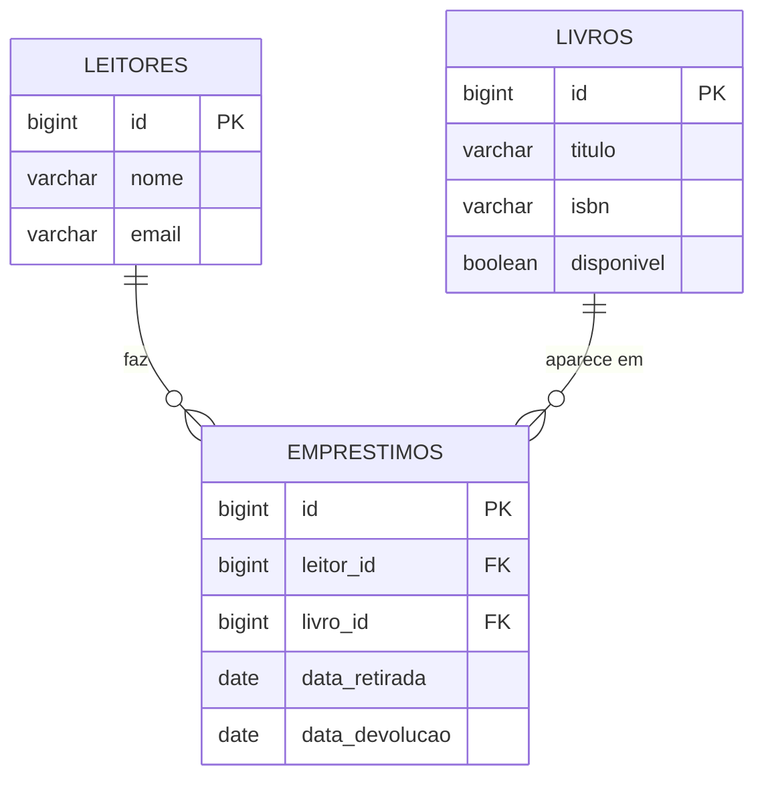

# 2. Modelo de domínio

## Entidades

### Livro

Um exemplar do acervo, que pode ser emprestado.

| Atributo | Tipo Java | Coluna | Obrigatório | Regra |
|---|---|---|---|---|
| `id` | `Long` | `id` | sim | Gerado pelo banco |
| `titulo` | `String` | `titulo` | sim | Até 255 caracteres |
| `isbn` | `String` | `isbn` | sim | Até 20 caracteres. Não é único: exemplares do mesmo título repetem o ISBN |
| `disponivel` | `boolean` | `disponivel` | sim | Nasce `true`; muda com o empréstimo e a devolução. O cliente não controla |

### Leitor

Uma pessoa cadastrada, que pode pegar livros emprestados.

| Atributo | Tipo Java | Coluna | Obrigatório | Regra |
|---|---|---|---|---|
| `id` | `Long` | `id` | sim | Gerado pelo banco |
| `nome` | `String` | `nome` | sim | Até 255 caracteres |
| `email` | `String` | `email` | sim | Formato de e-mail válido |

### Emprestimo

A retirada de um livro por um leitor.

| Atributo | Tipo Java | Coluna | Obrigatório | Regra |
|---|---|---|---|---|
| `id` | `Long` | `id` | sim | Gerado pelo banco |
| `leitor` | `Leitor` | `leitor_id` | sim | O leitor precisa existir |
| `livro` | `Livro` | `livro_id` | sim | O livro precisa existir e estar disponível (R2) |
| `dataRetirada` | `LocalDate` | `data_retirada` | sim | A API preenche com a data do dia |
| `dataDevolucao` | `LocalDate` | `data_devolucao` | não | Vazio enquanto o livro não volta |

## Relacionamentos

| De | Para | Tipo | No banco | No código |
|---|---|---|---|---|
| Emprestimo | Leitor | muitos para um | `emprestimos.leitor_id` referencia `leitores(id)` | `@ManyToOne` em `Emprestimo` |
| Emprestimo | Livro | muitos para um | `emprestimos.livro_id` referencia `livros(id)` | `@ManyToOne` em `Emprestimo` |

## Diagrama ER

Como ler: `||--o{` é "um para muitos". Um leitor faz zero ou vários empréstimos, e cada empréstimo é de exatamente um leitor. O mesmo vale para livro e empréstimo.

## Migrations

Todas existem em `src/main/resources/db/migration`, uma tabela por arquivo.

| Versão | Arquivo | O que cria |
|---|---|---|
| V1 | `V1__criar_livros.sql` | Tabela `livros` |
| V2 | `V2__criar_leitores.sql` | Tabela `leitores` |
| V3 | `V3__criar_emprestimos.sql` | Tabela `emprestimos`, com as duas chaves estrangeiras |
