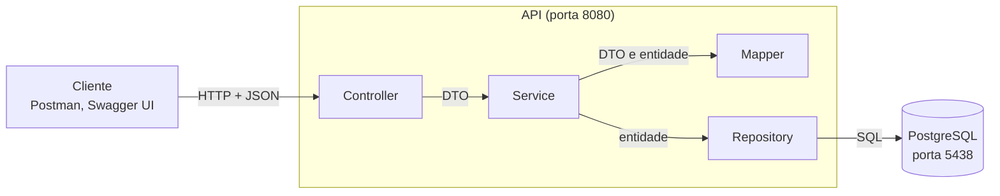
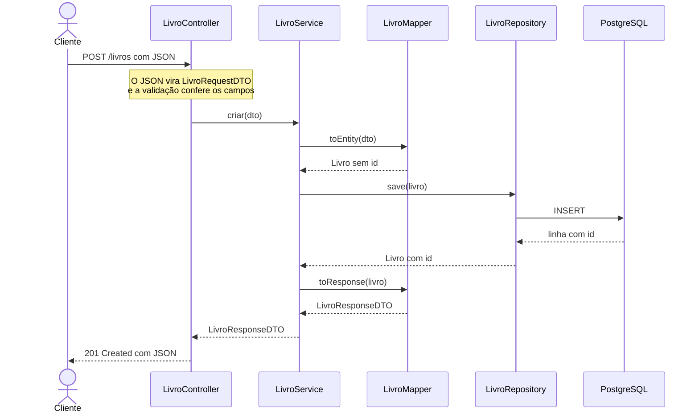

# 4. Arquitetura

## Tecnologias escolhidas

| O quê | Qual | Por quê |
|---|---|---|
| Linguagem e framework | Java 25 + Spring Boot 3.5 | É a base dos exemplos da disciplina e das próximas aulas |
| Banco de dados | PostgreSQL 16, em Docker | Banco relacional de verdade, que sobe com um comando |
| Acesso ao banco | Spring Data JPA (Hibernate) | O Repository vem pronto; o grupo só declara a interface |
| Migrations | Flyway | A estrutura do banco fica versionada no Git, junto com o código |
| Documentação da API | springdoc-openapi (Swagger UI) | O contrato é gerado do próprio código e dá para testar pelo navegador |

## Camadas

## Mapa da estrutura

✅ implementada · 🧱 montada (a classe existe e está ligada às outras, mas ainda não tem lógica).

| Entidade | Migration | Model | Repository | DTOs | Mapper | Service | Controller |
|---|---|---|---|---|---|---|---|
| Livro | `V1__criar_livros.sql` ✅ | `Livro` ✅ | `LivroRepository` ✅ | `LivroRequestDTO`, `LivroResponseDTO` ✅ | `LivroMapper` ✅ | `LivroService` ✅ | `LivroController` ✅ |
| Leitor | `V2__criar_leitores.sql` ✅ | `Leitor` ✅ | `LeitorRepository` ✅ | `LeitorRequestDTO`, `LeitorResponseDTO` ✅ | `LeitorMapper` 🧱 | `LeitorService` 🧱 | `LeitorController` 🧱 |
| Emprestimo | `V3__criar_emprestimos.sql` ✅ | `Emprestimo` ✅ | `EmprestimoRepository` ✅ | `EmprestimoRequestDTO`, `EmprestimoResponseDTO` ✅ | `EmprestimoMapper` 🧱 | `EmprestimoService` 🧱 | `EmprestimoController` 🧱 |

Também fazem parte do projeto, vindas do template: `ApiExceptionHandler`, `ErroDTO`, `CampoErroDTO`, `RecursoNaoEncontradoException` e `OpenApiConfig`. Do livro, ainda: `LivroNaoEncontradoException`.

## Onde mora cada regra de negócio

| Regra | Classe | Situação |
|---|---|---|
| R1: no máximo 3 empréstimos em aberto por leitor | `EmprestimoService` | 🧱 escrita no cabeçalho da classe |
| R2: livro emprestado não pode ser emprestado de novo | `EmprestimoService` | 🧱 escrita no cabeçalho da classe |
| R3: prazo de devolução de 14 dias | `EmprestimoService` decide o prazo; `EmprestimoMapper` calcula `dataLimite` e `atrasado` | 🧱 escrita no cabeçalho das duas classes |

## Fluxo de uma requisição

`POST /livros`, a rota que já funciona:

| Se... | Quem percebe | O cliente recebe |
|---|---|---|
| `titulo` vier vazio | A validação do `LivroRequestDTO`, antes de o Controller rodar | `400` com `campos` |
| o id de `GET /livros/{id}` não existir | `LivroService`, que lança `LivroNaoEncontradoException` | `404` |

## Infraestrutura

| Serviço | Onde roda | Porta |
|---|---|---|
| API | Máquina local (`./mvnw spring-boot:run`) | `8080` |
| PostgreSQL | Container Docker (`docker compose up -d`) | `5438` no host → `5432` no container |

## Decisões

| Decisão | Alternativa descartada | Por quê |
|---|---|---|
| Cada linha de `livros` é um exemplar, e o ISBN não é único | Uma tabela de títulos e outra de exemplares | Mais simples para esta etapa; dois exemplares do mesmo título viram duas linhas |
| A data de retirada é preenchida pela API | Receber a data no `EmprestimoRequestDTO` | O cliente não pode registrar um empréstimo com data falsa |
| No empréstimo, entram os ids de leitor e livro, e saem os objetos completos | Receber o leitor e o livro inteiros no JSON | Nome e título já estão no banco; o cliente só diz qual é qual |
| `dataLimite` e `atrasado` são calculados, não gravados | Colunas novas na tabela `emprestimos` | Dependem da data de hoje; gravar deixaria o valor velho no dia seguinte |
| Mapper escrito à mão | MapStruct | Poucos DTOs; a conversão fica visível no código |
