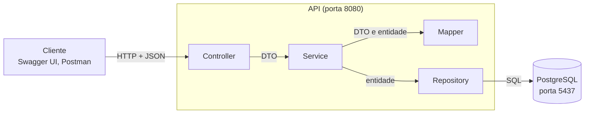
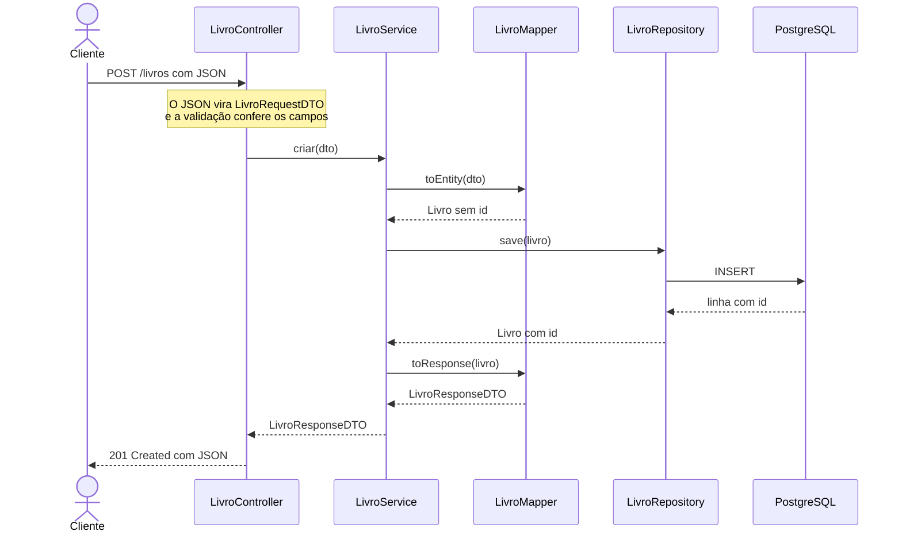

# 4. Arquitetura

> Como o desenho de `01` a `03` vira código. A arquitetura de referência da disciplina está em `Aula 10-11/ARQUITETURA.md`, no repositório do professor: aqui o grupo mostra como **o seu** projeto a segue. As linhas marcadas com *(exemplo)* mostram o nível de detalhe esperado: apague e escreva as do grupo.

## Tecnologias escolhidas

| O quê | Qual | Por quê |
|---|---|---|
| Linguagem e framework | {{Java 25 + Spring Boot 3.5}} | ... |
| Banco de dados | {{PostgreSQL 16, em Docker}} | ... |
| Acesso ao banco | {{Spring Data JPA (Hibernate)}} | ... |
| Migrations | {{Flyway}} | ... |
| Documentação da API | {{springdoc-openapi (Swagger UI)}} | ... |

## Camadas

## Mapa da estrutura

Uma linha por entidade, **todas** as do modelo. Em cada célula, o nome do arquivo e a situação: ✅ implementada ou 🧱 montada. Tem que bater com o que está em `src/`.

| Entidade | Migration | Model | Repository | DTOs | Mapper | Service | Controller |
|---|---|---|---|---|---|---|---|
| Livro *(exemplo)* | `V1__criar_livros.sql` ✅ | `Livro` ✅ | `LivroRepository` ✅ | `LivroRequestDTO`, `LivroResponseDTO` ✅ | `LivroMapper` ✅ | `LivroService` ✅ | `LivroController` ✅ |
| Leitor *(exemplo)* | `V2__criar_leitores.sql` ✅ | `Leitor` ✅ | `LeitorRepository` ✅ | `LeitorRequestDTO`, `LeitorResponseDTO` ✅ | `LeitorMapper` 🧱 | `LeitorService` 🧱 | `LeitorController` 🧱 |
| Emprestimo *(exemplo)* | `V3__criar_emprestimos.sql` ✅ | `Emprestimo` ✅ | `EmprestimoRepository` ✅ | `EmprestimoRequestDTO`, `EmprestimoResponseDTO` ✅ | `EmprestimoMapper` 🧱 | `EmprestimoService` 🧱 | `EmprestimoController` 🧱 |

## Onde mora cada regra de negócio

As regras de `01-visao-geral.md`, cada uma com a classe que vai aplicá-la.

| Regra | Classe | Situação |
|---|---|---|
| R1 *(exemplo)*: no máximo 3 empréstimos em aberto por leitor | `EmprestimoService` | 🧱 documentada no cabeçalho da classe |
| R2 *(exemplo)*: livro emprestado não pode ser emprestado de novo | `EmprestimoService` | 🧱 documentada no cabeçalho da classe |
| ... | ... | ... |

## Fluxo de uma requisição

O caminho completo de uma rota da API simples, com as classes do projeto, inclusive o que acontece quando dá erro.

| Se... | Quem percebe | O cliente recebe |
|---|---|---|
| `titulo` vier vazio *(exemplo)* | A validação do DTO, antes de o Controller rodar | `400` com `campos` |
| o id de `GET /livros/{id}` não existir *(exemplo)* | `LivroService`, que lança `LivroNaoEncontradoException` | `404` |

## Infraestrutura

| Serviço | Onde roda | Porta |
|---|---|---|
| API | Máquina local (`./mvnw spring-boot:run`) | `8080` |
| PostgreSQL | Container Docker (`docker compose up -d`) | `5437` no host → `5432` no container |

## Decisões

O que o grupo escolheu quando havia mais de um caminho.

| Decisão | Alternativa descartada | Por quê |
|---|---|---|
| Mapper escrito à mão *(exemplo)* | MapStruct | Poucos DTOs; a conversão fica visível no código |
| ... | ... | ... |
