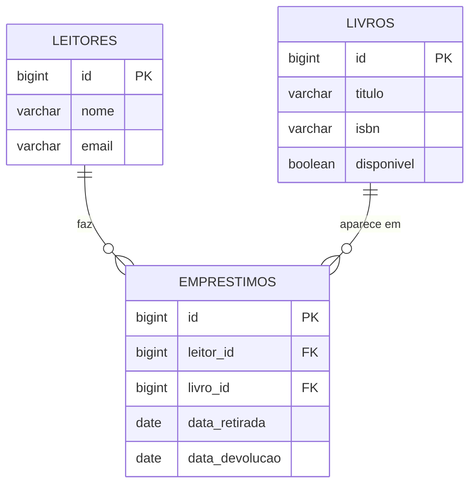

# Modelo de domínio

> No mínimo **3 entidades** e pelo menos **um relacionamento**. As linhas marcadas com *(exemplo)* mostram o nível de detalhe esperado: apague e escreva as do grupo.

## Entidades

Uma tabela por entidade. A coluna **Regra** é o que vira `NOT NULL`, `UNIQUE` ou validação no DTO.

### Livro *(exemplo)*

Um exemplar do acervo que pode ser emprestado.

| Atributo | Tipo Java | Coluna | Obrigatório | Regra |
|---|---|---|---|---|
| `id` | `Long` | `id` | sim | Gerado pelo banco |
| `titulo` | `String` | `titulo` | sim | Até 255 caracteres |
| `isbn` | `String` | `isbn` | sim | Até 20 caracteres. Não é único: exemplares do mesmo título repetem o ISBN |
| `disponivel` | `boolean` | `disponivel` | sim | Nasce `true`; o cliente não controla |

### {{Entidade 2}}

{{O que ela representa, em uma linha.}}

| Atributo | Tipo Java | Coluna | Obrigatório | Regra |
|---|---|---|---|---|
| `id` | `Long` | `id` | sim | Gerado pelo banco |
| ... | ... | ... | ... | ... |

### {{Entidade 3}}

{{O que ela representa, em uma linha.}}

| Atributo | Tipo Java | Coluna | Obrigatório | Regra |
|---|---|---|---|---|
| `id` | `Long` | `id` | sim | Gerado pelo banco |
| ... | ... | ... | ... | ... |

## Relacionamentos

| De | Para | Tipo | No banco | No código |
|---|---|---|---|---|
| Emprestimo *(exemplo)* | Leitor | muitos para um | `emprestimos.leitor_id` referencia `leitores(id)` | `@ManyToOne` em `Emprestimo` |
| Emprestimo *(exemplo)* | Livro | muitos para um | `emprestimos.livro_id` referencia `livros(id)` | `@ManyToOne` em `Emprestimo` |
| ... | ... | ... | ... | ... |

## Diagrama ER

O GitHub desenha o bloco abaixo sozinho. Troque pelas tabelas do grupo, com os nomes das colunas como estarão no banco (`snake_case`).

Como ler: `||--o{` é "um para muitos". Um leitor faz zero ou vários empréstimos, e cada empréstimo é de exatamente um leitor.

## Migrations

Todas existem em `src/main/resources/db/migration`, uma tabela por arquivo. A ordem importa: a tabela referenciada nasce antes da que referencia.

| Versão | Arquivo | O que cria |
|---|---|---|
| V1 *(exemplo)* | `V1__criar_livros.sql` | Tabela `livros` |
| V2 *(exemplo)* | `V2__criar_leitores.sql` | Tabela `leitores` |
| V3 *(exemplo)* | `V3__criar_emprestimos.sql` | Tabela `emprestimos`, com as duas chaves estrangeiras |
